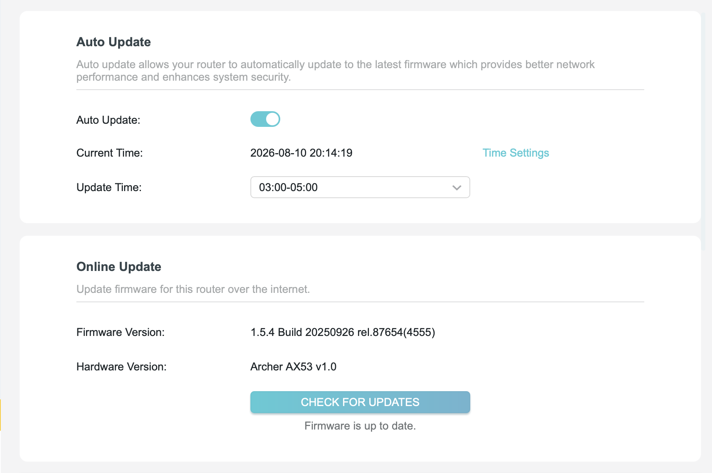
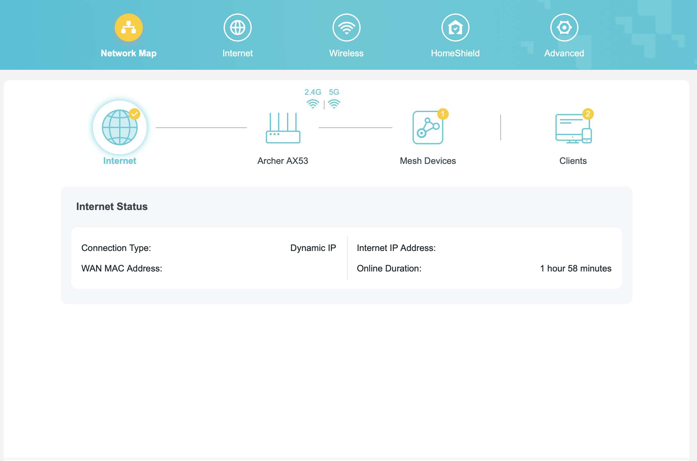
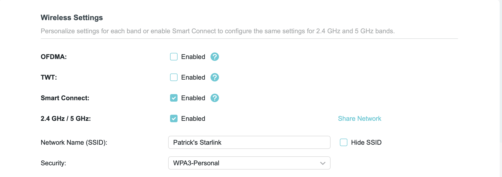
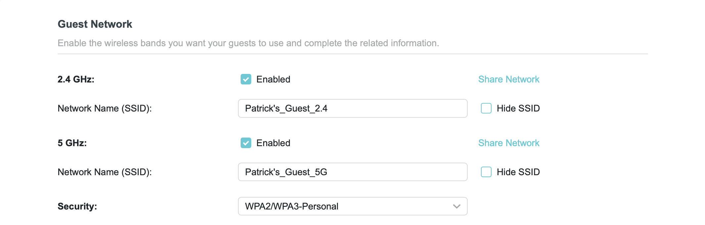
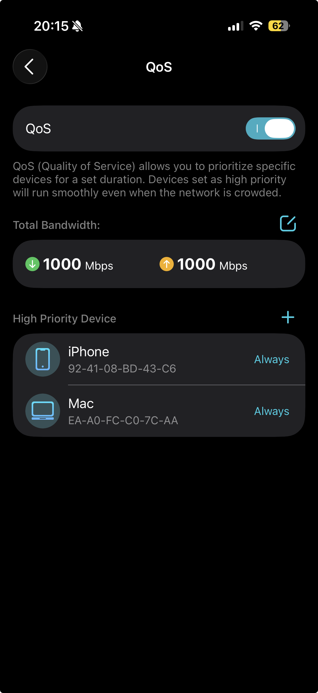

                   Internet
                       │
                Starlink Satellite
                       │
                 Starlink Mini
                 (Bypass Mode)
                       │
                 WAN (DHCP)
                       │
        ┌──────────────────────────┐
        │ TP-Link Archer AX53      │
        └──────────────────────────┘
             │                 │
      Main Network        Guest Network
      (Trusted)           (Isolated)
          │                   │
   MacBook Air M2      Phones / Laptops
   iPhone              8–9 Guest Devices

# Starlink Mini & TP-Link Archer AX53 Network Deployment

## Project Overview

Configured a TP-Link Archer AX53 router to replace the built-in routing functionality of a Starlink Mini by enabling Starlink Bypass Mode.

The objective was to improve wireless coverage, increase network security, prioritize trusted devices, and provide isolated guest access for multiple users.

This deployment provides secure internet access for trusted personal devices while isolating guest devices on a separate wireless network.

---

## Hardware

- Starlink Mini
- TP-Link Archer AX53 v1.0
- Ethernet connection from Starlink Mini to AX53 WAN Port

---

## Firmware

Firmware:
1.5.4 Build 20250926

**Firmware Information**

Current firmware configuration

---

## Technologies

- Starlink Mini
- TP-Link Archer AX53
- TP-Link Tether
- DHCP
- WPA2/WPA3
- Quality of Service (QoS)
- Guest Network Isolation

---

## Network Configuration

### Internet

- WAN Type: Dynamic IP (DHCP)
- Starlink Router: Bypass Mode Enabled
- Internet Connectivity Verified

**Router Dashboard**

The router dashboard confirms a successful WAN connection to the Starlink Mini operating in Bypass Mode.

---

## Wireless Networks

### Main Network

Purpose:
Trusted personal devices.

Connected Devices

- MacBook Air M2
- iPhone

Security

- WPA2/WPA3
- Strong password

**Main Network**  

The trusted wireless network used for personal devices.

---

### Guest Network

Purpose:
Internet access for approximately 8–9 users.

Configuration

- 2.4 GHz Enabled
- 5 GHz Enabled
- Local Network Access Disabled

Outcome

Guest devices can access the internet but cannot access resources on the primary network.

**Guest Network**

Guest wireless network configured with local network access disabled.

---

## Quality of Service (QoS)

Configured priority devices using the TP-Link Tether application.

High Priority Devices

- MacBook Air M2
- iPhone

Purpose

Ensure important devices receive bandwidth preference during periods of heavy network usage.

**QoS Configuration**

Priority devices configured through the TP-Link Tether application.

---

## Security Measures

- Starlink Router placed into Bypass Mode
- Guest Network enabled
- Local Access disabled for Guest Network
- WPA2/WPA3 encryption
- Firmware updated
- Separate trusted and guest networks

---

## Skills Demonstrated

- Router deployment
- DHCP configuration
- WAN configuration
- Wireless network administration
- Guest network isolation
- Quality of Service configuration
- Network security hardening
- Mobile router management
- Starlink integration   
- Network topology documentation

---

## Lessons Learned

- Starlink Mini must be placed into Bypass Mode when using a third-party router.
- The Archer AX53 automatically obtained a WAN IP using DHCP.
- QoS settings were available only in the TP-Link Tether mobile application.
- Guest network permissions are managed through the "Allow Local Access" setting.
- Verified guest devices cannot access the primary local network.

---

## Planned Enhancements

- Configure custom DNS servers (Cloudflare or Quad9)
- Create DHCP reservations for lab devices
- Enable IPv6 and document configuration
- Configure remote administration securely
- Deploy a managed switch for VLAN segmentation
- Expand the network with EasyMesh access points

---

## Key Takeaways

This project provided hands-on experience configuring a consumer router for production use, integrating third-party networking hardware with Starlink, implementing wireless network segmentation, and documenting a real-world deployment using GitHub.

---

## Project Status

Completed

This network is currently deployed and operational, providing internet connectivity and secure guest access through a TP-Link Archer AX53 integrated with Starlink Mini.