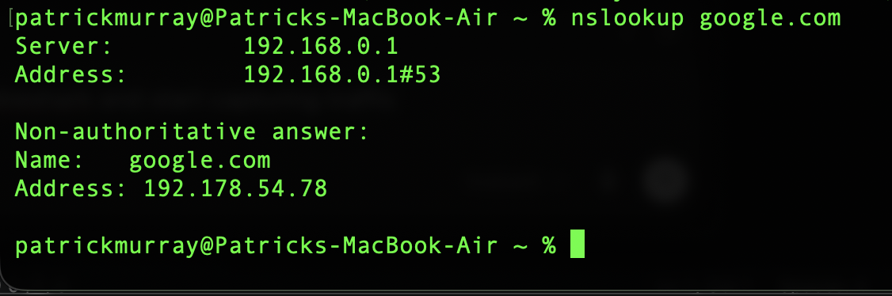
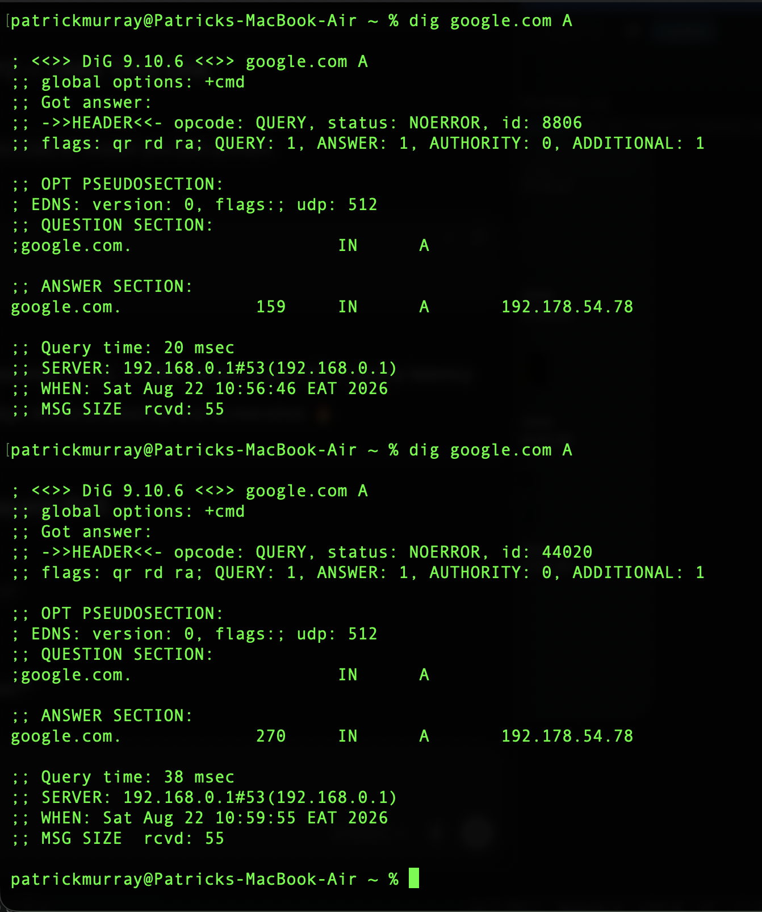
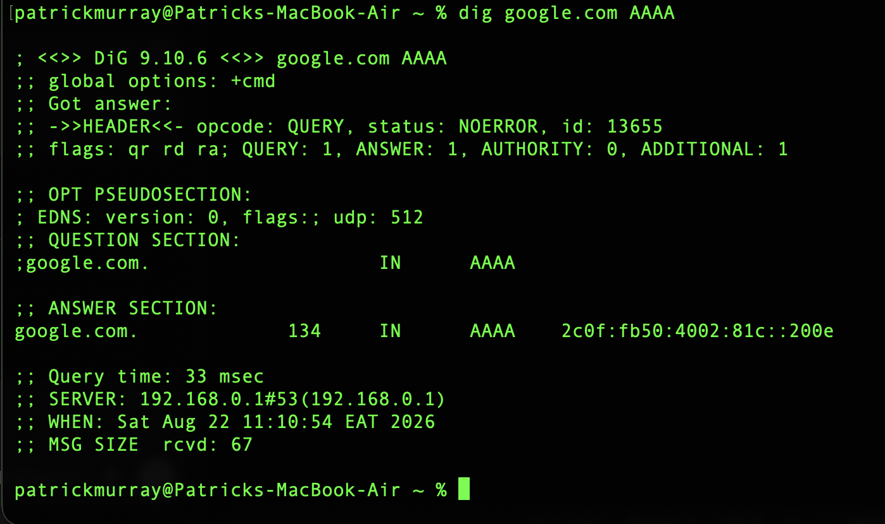
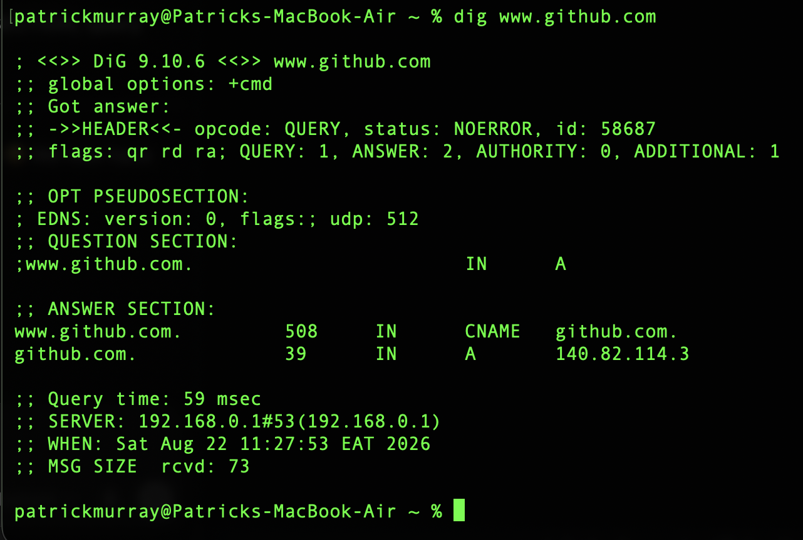
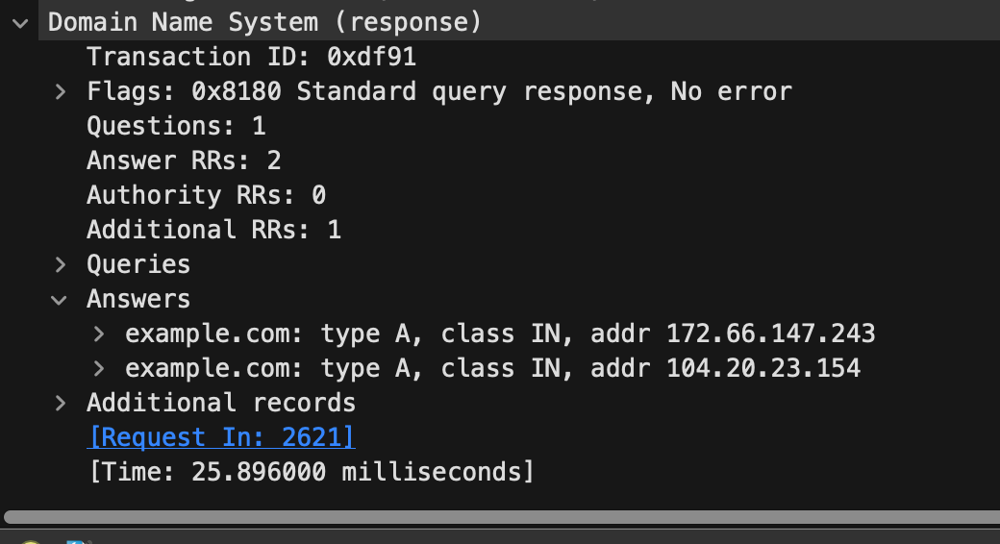
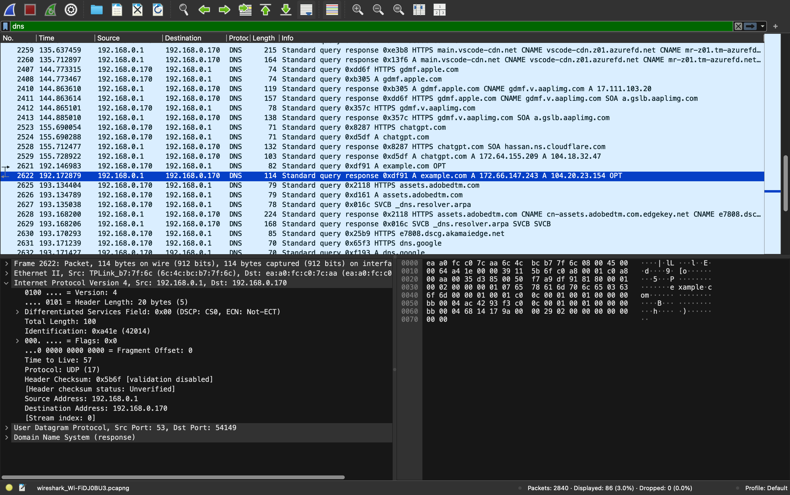

# DNS Fundamentals

**Status:** ✅ Complete

**Difficulty:** Beginner

**Estimated Time:** 2–3 hours

**Last Updated:** August 2026

**Technologies Used**

- macOS
- Terminal
- DNS
- `scutil`
- `nslookup`
- `dig`
- Wireshark
- IPv4
- IPv6
- UDP

---

# Objective

Explore Domain Name System (DNS) configuration and name resolution from a macOS workstation using command-line troubleshooting tools and Wireshark.

The objective of this lab was to identify the DNS resolver used by the local system, query multiple DNS record types, interpret DNS responses, and capture DNS traffic at the packet level.

This project reinforced concepts studied for CompTIA Network+, including DNS record types, DNS caching, IPv4 and IPv6 name resolution, UDP port 53, ephemeral client ports, and protocol encapsulation.

---

# Lab Environment

| Component | Value |
|-----------|-------|
| Host | Apple MacBook Air M2 |
| Operating System | macOS |
| Network Interface | Wi-Fi (`en0`) |
| Local IPv4 Address | `192.168.0.170` |
| DNS Resolver | `192.168.0.1` |
| Router | TP-Link Archer AX53 |
| Analysis Tool | Wireshark |
| DNS Query Tools | `nslookup`, `dig` |

The MacBook was connected to the existing TP-Link Archer AX53 network deployed as part of the IT Home Lab.

---

# DNS Configuration

## Identify the Configured DNS Resolver

Used the macOS System Configuration utility to inspect the system's DNS configuration.

```bash
scutil --dns
```

`scutil` is the macOS System Configuration utility. The `--dns` option displays the DNS resolver configuration currently being used by the operating system.

The output identified:

```text
nameserver[0] : 192.168.0.1
```

This confirmed that the MacBook was configured to send DNS queries to the local router at `192.168.0.1`.

---

# DNS Query Analysis

## Basic DNS Lookup with nslookup

Performed a DNS lookup for `google.com` using:

```bash
nslookup google.com
```

The response showed:

```text
Server:     192.168.0.1
Address:    192.168.0.1#53
```

This independently confirmed that DNS queries were being sent to `192.168.0.1` using DNS port 53.

The lookup returned an IPv4 address for `google.com`.

**DNS Lookup**



This demonstrated basic hostname-to-IPv4 address resolution.

---

## A Record

Used `dig` to explicitly request the A record for `google.com`.

```bash
dig google.com A
```

`dig` is a DNS query and troubleshooting utility that provides more detailed DNS response information than a basic lookup.

The query returned:

```text
google.com.    IN    A    192.178.54.78
```

An **A record** maps a hostname or domain name to an IPv4 address.

The response also displayed:

- DNS response status
- DNS record type
- Time To Live (TTL)
- Query time
- DNS resolver
- DNS port

**A Record Query**



The DNS TTL represented the amount of time the returned DNS record could remain cached before requiring a refresh.

Repeated queries also demonstrated that the observed remaining TTL does not necessarily decrease monotonically between every query because responses may be served from refreshed or different upstream resolver cache states.

---

## AAAA Record

Queried the AAAA record for `google.com`.

```bash
dig google.com AAAA
```

The query returned an IPv6 address:

```text
2c0f:fb50:4002:81c::200e
```

An **AAAA record** maps a hostname or domain name to an IPv6 address.

**AAAA Record Query**



This demonstrated that the same hostname can have records for both IPv4 and IPv6.

The DNS server itself was still reached using the IPv4 address `192.168.0.1`. This demonstrated that the IP version used to communicate with a DNS resolver does not determine which DNS record types can be requested.

A client communicating with a DNS resolver over IPv4 can still request and receive an IPv6 AAAA record.

The IPv6 response also demonstrated IPv6 zero compression using `::`.

---

## MX Record

Queried the Mail Exchanger record for `google.com`.

```bash
dig google.com MX
```

The response identified:

```text
google.com.    IN    MX    10 smtp.google.com.
```

An **MX record** identifies the mail server responsible for accepting email for a domain.

The value:

```text
10
```

represents the MX preference value.

Lower MX preference values are preferred over higher values when multiple mail exchangers are available.

This query demonstrated that DNS stores more information than hostname-to-IP mappings.

---

## CNAME Record

Queried `www.github.com` using:

```bash
dig www.github.com
```

Because no record type was explicitly provided, `dig` performed an A-record query by default.

The response demonstrated a DNS resolution chain:

```text
www.github.com
      ↓
    CNAME
      ↓
github.com
      ↓
   A Record
      ↓
IPv4 Address
```

The CNAME record identified `www.github.com` as an alias for `github.com`.

DNS then returned an A record for the canonical hostname.

**CNAME Resolution**



This demonstrated how CNAME records allow one hostname to reference another hostname instead of maintaining a separate IP address mapping.

---

# DNS Packet Capture

## Capture Process

Started a Wireshark capture on the macOS Wi-Fi interface:

```text
en0
```

Applied the following Wireshark display filter:

```text
dns
```

A display filter does not limit which packets Wireshark captures. Instead, it limits which already-captured packets are displayed for analysis.

Generated DNS traffic from Terminal using:

```bash
dig example.com A
```

The capture was then stopped and the corresponding DNS query and response were identified.

---

# Query and Response Analysis

The DNS query traveled from:

```text
192.168.0.170 → 192.168.0.1
```

The response traveled in the opposite direction:

```text
192.168.0.1 → 192.168.0.170
```

The query requested an A record for:

```text
example.com
```

The response contained two A resource records:

```text
172.66.147.243
104.20.23.154
```

This demonstrated that a hostname can have multiple A records.

---

## DNS Transaction ID

The captured query and response shared the transaction ID:

```text
0xdf91
```

The DNS transaction ID allows a client to associate a DNS response with the query that generated it.

Wireshark also linked the response directly to the original request packet and displayed the elapsed time between the query and response.

**DNS Response Details**



The response contained:

- 1 DNS question
- 2 answer resource records
- 0 authority resource records
- 1 additional resource record

The additional `OPT` pseudo-record was associated with Extension Mechanisms for DNS (EDNS).

---

# UDP Port Analysis

The DNS query used UDP.

The query traveled from:

```text
192.168.0.170:54149 → 192.168.0.1:53
```

Port `54149` was an ephemeral client port selected by macOS for the DNS communication.

Port `53` was the destination port used by the DNS service.

The DNS response reversed the communication:

```text
192.168.0.1:53 → 192.168.0.170:54149
```

This demonstrated the relationship between IP addresses and transport-layer port numbers.

The IP address identifies the communicating network interface or host endpoint, while the port number identifies the service or application endpoint involved in the communication.

---

# Protocol Encapsulation

Wireshark displayed the DNS response across multiple protocol layers:

```text
Internet Protocol Version 4
        ↓
User Datagram Protocol
        ↓
Domain Name System
```

The IPv4 header identified:

```text
Source Address:      192.168.0.1
Destination Address: 192.168.0.170
Protocol:            UDP
```

The UDP header identified:

```text
Source Port:      53
Destination Port: 54149
```

The DNS payload contained the DNS query response and returned A records.

**DNS Protocol Encapsulation**



This capture provided a practical demonstration of protocol encapsulation and reinforced the relationship between Layer 3 addressing, Layer 4 transport, and Layer 7 application protocols.

---

# DNS TTL vs IP TTL

This lab exposed two different uses of the term **TTL (Time To Live)**.

## DNS TTL

DNS TTL determines how long a DNS record may remain cached before it should be refreshed.

Example:

```text
google.com.    159    IN    A    192.178.54.78
```

The TTL value applies to the DNS record.

## IPv4 TTL

Wireshark also displayed a TTL value inside the IPv4 header.

IPv4 TTL limits how many router hops a packet can survive before being discarded.

Each router forwarding an IPv4 packet normally decreases the TTL value. If the value reaches zero, the packet is discarded.

Although both fields are called TTL, they serve completely different purposes.

---

# Observations

During the lab, the following behaviors were observed:

- The MacBook used `192.168.0.1` as its DNS resolver.
- DNS queries were sent to UDP port 53.
- A records returned IPv4 addresses.
- AAAA records returned IPv6 addresses.
- MX records identified mail exchangers.
- CNAME records created aliases between hostnames.
- One hostname could return multiple A records.
- DNS records included TTL values used for caching.
- DNS queries used temporary client-side ephemeral ports.
- DNS query and response packets shared a transaction ID.
- DNS responses could be inspected through IPv4, UDP, and DNS protocol layers.
- IPv4 communication with a DNS resolver could still retrieve IPv6 AAAA records.

---

# Verification

Successfully verified:

- Local DNS resolver configuration
- DNS name resolution
- A record queries
- AAAA record queries
- MX record queries
- CNAME resolution
- DNS TTL information
- UDP port 53 communication
- Client ephemeral port usage
- DNS transaction IDs
- Multiple A records for a single hostname
- DNS query and response packet capture
- IPv4, UDP, and DNS protocol encapsulation

---

# Commands Used

### DNS Configuration

```bash
scutil --dns
```

### Basic DNS Lookup

```bash
nslookup google.com
```

### A Record Query

```bash
dig google.com A
```

### AAAA Record Query

```bash
dig google.com AAAA
```

### MX Record Query

```bash
dig google.com MX
```

### CNAME Resolution

```bash
dig www.github.com
```

### Generate DNS Traffic for Wireshark

```bash
dig example.com A
```

---

# Skills Practiced

- DNS configuration analysis
- DNS troubleshooting
- Command-line network diagnostics
- A record analysis
- AAAA record analysis
- MX record analysis
- CNAME resolution
- IPv4 and IPv6 DNS resolution
- DNS caching concepts
- Wireshark packet capture
- Wireshark display filtering
- UDP port analysis
- Ephemeral port identification
- DNS transaction analysis
- Protocol encapsulation analysis
- Packet-level network troubleshooting

---

# Lessons Learned

This lab demonstrated that DNS is more than a simple hostname-to-IP address lookup service.

Different DNS record types provide different information:

- A records identify IPv4 addresses.
- AAAA records identify IPv6 addresses.
- MX records identify mail exchangers.
- CNAME records create aliases between hostnames.

The lab also demonstrated how DNS caching uses TTL values and reinforced the distinction between a DNS record TTL and the TTL contained within an IPv4 packet header.

Capturing DNS traffic with Wireshark showed how an application-layer DNS request is transported using UDP and IPv4.

The DNS query used an ephemeral client port as its source and UDP port 53 as its destination. The DNS response reversed those ports to return the answer to the correct client process.

Matching DNS transaction IDs demonstrated how individual queries and responses can be correlated during packet analysis.

---

# Reflection

Before completing this lab, I primarily understood DNS as the service responsible for translating domain names into IP addresses.

Working directly with `nslookup` and `dig` demonstrated that DNS is a distributed system containing several different types of records, each serving a different purpose. Querying A, AAAA, MX, and CNAME records made the differences between these records much easier to understand than memorizing their definitions alone.

Capturing the DNS exchange in Wireshark connected several previously studied networking concepts. I was able to follow a DNS request from my MacBook to the local DNS resolver, identify the source and destination IP addresses, examine the UDP source and destination ports, and inspect the DNS response itself.

The packet capture also reinforced protocol encapsulation by showing IPv4 carrying UDP and UDP carrying DNS data.

This project helped connect DNS, IPv4, IPv6, UDP, port numbers, and the OSI model into a single observable network transaction rather than viewing each topic as an isolated concept.

---

# Project Outcome

Successfully analyzed DNS configuration and name resolution from the macOS command line and captured DNS communication at the packet level using Wireshark.

The project provided practical experience querying multiple DNS record types, interpreting DNS responses, analyzing UDP communication, identifying DNS transaction IDs, and following DNS traffic through the network protocol stack.

The completed lab reinforces DNS concepts required for CompTIA Network+ while developing practical network troubleshooting and packet-analysis skills.

---

# Next Steps

- Analyze DHCP configuration
- Capture DHCP traffic with Wireshark
- Observe the DHCP DORA process
- Configure DHCP reservations for lab devices
- Examine IPv6 configuration
- Investigate SLAAC and IPv6 neighbor discovery
- Continue expanding DNS troubleshooting skills

---

*End of Project Documentation*