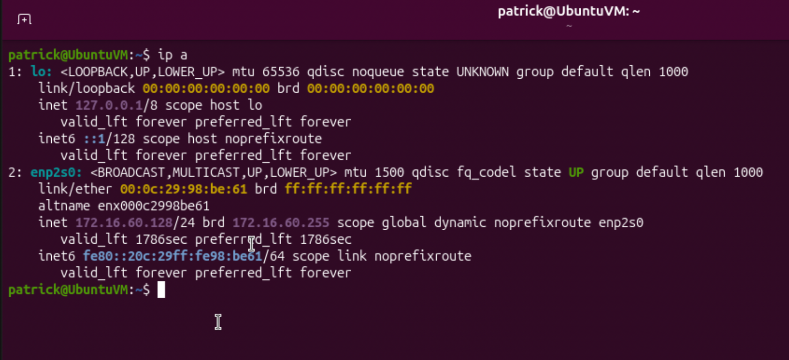
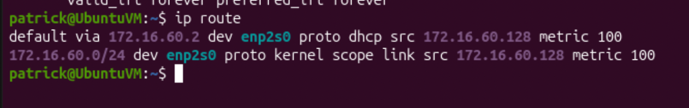
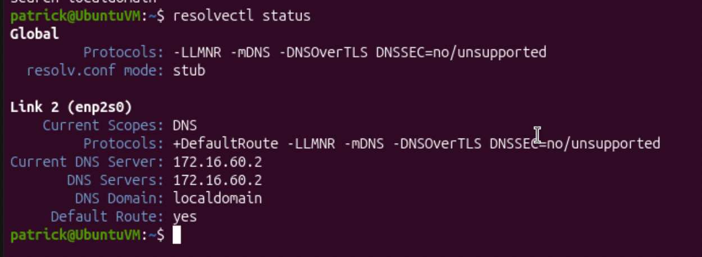
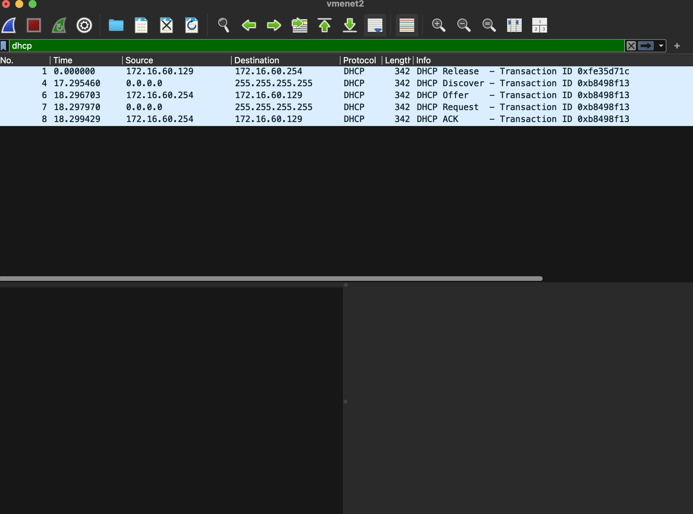

# DHCP Fundamentals Lab

**Status:** ✅ Complete

**Difficulty:** Beginner / Intermediate

**Estimated Time:** 2–3 hours

**Last Updated:** August 2026

## Technologies Used

- Ubuntu Linux
- VMware Fusion
- Wireshark
- DHCP (Dynamic Host Configuration Protocol)
- Linux networking utilities

---

# Objective

The purpose of this project was to understand and analyze the Dynamic Host Configuration Protocol (DHCP) process through hands-on investigation, troubleshooting, and packet analysis.

This lab demonstrates how a DHCP client obtains network configuration information, including:

- IPv4 address
- Subnet mask
- Default gateway
- DNS server
- DHCP lease information

This project supports Network+ objectives related to:

- DHCP operation
- IPv4 addressing
- Network troubleshooting
- DNS integration
- Packet analysis

This lab expands the IT Home Lab by moving beyond theory and demonstrating how networking services operate through real traffic analysis.

---

# Lab Environment

| Component | Value |
|-----------|-------|
| Host | MacBook Air M2 |
| Operating System | Ubuntu Linux VM |
| Hypervisor | VMware Fusion |
| Network | VMware Virtual NAT Network (172.16.60.0/24) |
| Tools | Terminal, dhclient, Wireshark |

The Ubuntu virtual machine was configured as a DHCP client on VMware Fusion's virtual network.

VMware provided DHCP services and assigned network configuration to the Ubuntu client.

---

# Implementation

## 1. Identify Existing Network Configuration

The first step was documenting the Ubuntu VM's current network configuration.

Command used:

```bash
ip a
```

This command displays:

- Network interfaces
- MAC addresses
- IPv4 addresses
- IPv6 addresses
- Interface status

The Ubuntu VM was using:

```
Interface: enp2s0
IPv4 Address: 172.16.60.128/24
Broadcast Address: 172.16.60.255
```

The IPv6 address observed was a link-local address:

```
fe80::20c:29ff:fe98:be61/64
```

Link-local IPv6 addresses begin with `FE80` and are used for communication on the local network segment.



---

## 2. Identify Default Gateway

The next step was determining where Ubuntu sent traffic outside the local network.

Command used:

```bash
ip route
```

The output showed:

```
default via 172.16.60.2
```

This identified the VMware virtual gateway.

Network information:

| Setting | Value |
|-----------|-----------|
| Network | 172.16.60.0/24 |
| Default Gateway | 172.16.60.2 |



---

## 3. Analyze DHCP Lease Acquisition

The DHCP client utility was used to manually release and request a DHCP lease.

The DHCP client package was installed:

```bash
sudo apt install isc-dhcp-client
```

The existing lease was released:

```bash
sudo dhclient -r
```

A new DHCP lease was requested:

```bash
sudo dhclient -v
```

The DHCP exchange followed the DORA process:

1. DHCP Discover
2. DHCP Offer
3. DHCP Request
4. DHCP Acknowledgment (ACK)

Observed DHCP server:

```
172.16.60.254
```

New assigned address:

```
172.16.60.129
```

---

## 4. Verify DNS Configuration

DHCP also provided DNS configuration information.

Initial command:

```bash
cat /etc/resolv.conf
```

Ubuntu displayed:

```
nameserver 127.0.0.53
```

This is Ubuntu's local systemd-resolved DNS stub.

The actual DNS server provided through DHCP was verified using:

```bash
resolvectl status
```

Observed DNS server:

```
172.16.60.2
```



---

## 5. Capture DHCP Traffic Using Wireshark

Wireshark was used to capture the DHCP exchange at the packet level.

Capture interface:

```
vmnet2
```

Display filter:

```
dhcp
```

The capture successfully demonstrated the complete DHCP DORA process.



Captured communication:

| DHCP Step | Source | Destination |
|-----------|--------|-------------|
| DHCP Discover | 0.0.0.0 | 255.255.255.255 |
| DHCP Offer | 172.16.60.254 | 172.16.60.129 |
| DHCP Request | 0.0.0.0 | 255.255.255.255 |
| DHCP ACK | 172.16.60.254 | 172.16.60.129 |

---

# Observations

- DHCP clients initially broadcast requests because they do not know the DHCP server's address.
- DHCP Discover messages originate from `0.0.0.0` because the client does not yet have an assigned IP address.
- VMware Fusion acted as the DHCP server for the virtual network.
- DHCP provides more than an IP address; it also provides gateway and DNS information.
- Ubuntu uses systemd-resolved, which creates a local DNS stub resolver.
- Wireshark confirmed the DHCP DORA process through packet capture.

---

# Verification

Successful completion was verified by:

- Confirming Ubuntu received a DHCP-assigned IPv4 address.
- Identifying the DHCP server.
- Capturing DHCP Discover, Offer, Request, and ACK packets.
- Confirming DNS resolution.
- Confirming internet connectivity.

Connectivity test:

```bash
ping -c 4 google.com
```

Results:

- Successful DNS resolution
- Successful packet transmission
- 0% packet loss

---

# Troubleshooting

## Problem 1: DHCP Client Command Missing

### Investigation

The first attempt to run:

```bash
sudo dhclient -v
```

returned:

```
sudo: 'dhclient': command not found
```

The DHCP client utility was not installed.

### Resolution

Installed the required package:

```bash
sudo apt install isc-dhcp-client
```

The DHCP testing process continued successfully.

---

## Problem 2: Accidental Continuous Terminal Output

### Investigation

While troubleshooting, the `yes` command was accidentally executed, causing continuous terminal output:

```
y
y
y
y
```

### Resolution

The process was stopped using:

```
Ctrl + C
```

Network functionality was verified afterward using:

```bash
ip a
ip route
```

The system remained operational.

---

# Commands Used

## Network Configuration

```bash
ip a
ip route
```

## DHCP Testing

```bash
sudo apt install isc-dhcp-client
sudo dhclient -r
sudo dhclient -v
```

## DNS Verification

```bash
cat /etc/resolv.conf
resolvectl status
```

## Connectivity Testing

```bash
ping -c 4 google.com
```

---

# Skills Practiced

- DHCP troubleshooting
- Linux networking
- IPv4 addressing
- DNS troubleshooting
- Default gateway analysis
- Wireshark packet analysis
- Virtual networking
- Command-line troubleshooting

---

# Lessons Learned

This project demonstrated that DHCP is much more than automatic IP address assignment.

DHCP provides the configuration required for a device to participate on a network, including addressing information, routing information, and DNS configuration.

Capturing DHCP traffic with Wireshark transformed DHCP from a memorized certification concept into an observable networking process.

The project also reinforced the troubleshooting methodology:

1. Observe the current state.
2. Form a hypothesis.
3. Test the hypothesis.
4. Analyze evidence.
5. Verify the solution.

---

# Project Outcome

The DHCP Fundamentals Lab successfully demonstrated the DHCP lease process using an Ubuntu virtual machine, VMware Fusion, and Wireshark.

The completed project verified:

- DHCP client communication
- DHCP server identification
- IP address assignment
- DNS configuration
- Network connectivity
- Packet-level DHCP analysis

This project provides the foundation for future networking and cybersecurity labs involving:

- Virtual firewalls
- VLAN segmentation
- Routing
- Network monitoring
- Security controls

---

# Next Steps

- Build a virtual firewall/router lab using OpenWrt ARM64
- Configure custom DHCP scopes
- Create segmented virtual networks
- Analyze firewall traffic
- Deploy OPNsense on physical hardware in the future

---

# Reflection

Before completing this project, DHCP was primarily understood as the DORA acronym and a Network+ objective.

After completing this lab, DHCP became a practical networking service that could be observed, analyzed, and troubleshot.

The largest takeaway was learning to use system output, logs, and packet captures as evidence instead of simply following configuration steps.

This lab strengthened the connection between networking theory, Linux administration, and cybersecurity troubleshooting.

---

*End of Project Documentation*